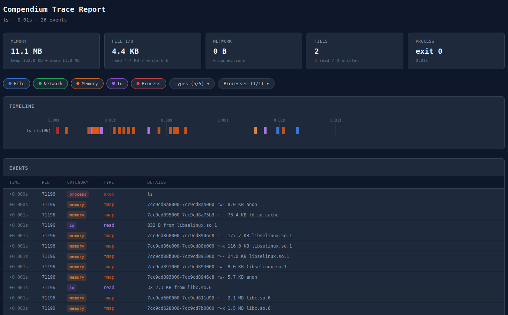

# compendium

A user-friendly strace like tracer for x86 Linux with HTML reports.
See's syscalls and display files opened, network connections, memory allocations
and more!



## Features

- **File tracking**: See every file opened for read or write
- **Network tracking**: TCP/UDP connections, bytes sent/received
- **Memory tracking**: Heap growth (brk), mmap regions with addresses and permissions
- **I/O tracking**: Read/write operations with file names, copy_file_range, sendfile
- **Process tracking**: Fork, clone, exec events with thread vs process differentiation
- **Page fault tracking**: Optional detailed view of memory growth via perf_event_open
- **HTML report**: Interactive timeline and event table with `--report`

## Installation

```bash
cargo build --release
```

## Usage

Trace a command:
```bash
compendium -- curl -s https://example.com
compendium -- ls -la
compendium -- cp /etc/hosts /tmp/hosts-copy
```

Attach to a running process:
```bash
./target/release/compendium --pid 1234
```

Enable page fault tracking (requires elevated permissions):
```bash
echo 0 | sudo tee /proc/sys/kernel/perf_event_paranoid
sudo compendium --faults -- ls
```

Generate an interactive HTML report:
```bash
compendium --report report.html -- curl -s https://example.com
```

### Options

```
-p, --pid <PID>       Attach to existing PID instead of spawning
-v, --verbose         Show raw syscalls as they happen
    --faults          Track page faults in heap/anon regions (requires sudo or perf)
    --report <FILE>   Generate interactive HTML report
-h, --help            Print help
```

## Example Output

```
compendium: tracing curl -s https://example.com
[+0.000s] ─── curl exec ───
[+0.002s] mmap 7f8a12345000-7f8a12347000 rw-   8.0 KB anon
[+0.003s] open /etc/resolv.conf (read)
[+0.015s] connect tcp4 → 93.184.216.34:443
[+0.156s] send    517 B
[+0.234s] recv   1.4 KB
[+0.235s] recv   1.2 KB

━━━━━━━━━━━━━━━━━━━━━━━━━━━━━━━━━━━━━━━━━━━━━━━━━━━━━━━━━━━━━━━━
 FINAL: curl -s https://example.com (0.34s)
━━━━━━━━━━━━━━━━━━━━━━━━━━━━━━━━━━━━━━━━━━━━━━━━━━━━━━━━━━━━━━━━
 Memory:
   Heap:     132.0 KB
   Mmap:     8.5 MB (24 regions)
   Total:    8.6 MB
 I/O:
   Files read:       12.4 KB
   Files written:       0 B
   Net sent:          517 B
   Net received:     2.6 KB
 Network connections:
   tcp4 → 93.184.216.34:443
 Exit: 0
━━━━━━━━━━━━━━━━━━━━━━━━━━━━━━━━━━━━━━━━━━━━━━━━━━━━━━━━━━━━━━━━
```

## How It Works

compendium uses Linux ptrace to intercept syscalls. For each syscall it:

1. Captures entry (syscall number and arguments)
2. Captures exit (return value)
3. Reads strings/buffers from tracee memory as needed
4. Tracks file descriptors to distinguish files from sockets
5. Outputs events in real-time with timestamps

For page fault tracking, it uses perf_event_open to monitor minor page faults in heap and anonymous mmap regions, showing actual memory growth as pages are touched.

## HTML Report

The `--report` flag generates a self-contained HTML file with:

- **Timeline**: SVG swimlane view with one lane per process/thread, zoomable with Ctrl+scroll or +/- keys
- **Event table**: Virtual-scrolled list of all events with timestamps, PIDs, types, and details
- **Filters**: Toggle event categories (file, network, memory, I/O, process), individual event types, and processes
- **Thread differentiation**: Threads are visually distinct from processes — shown with "↳" prefix and dimmer italic styling in both the timeline and table
- **Type-specific colors**: Events within each category use distinct color shades (e.g., read vs write, send vs recv) so they're distinguishable at a glance

## Filtered Output

To reduce noise, we filter out:
- System paths: /proc, /sys, /dev
- Dynamic linker files: ld.so, ld-linux, .so files
- Localhost connections (127.0.0.1, 127.0.0.53)

## Signal Handling (Ctrl-C)

When tracing a spawned command:
- **First Ctrl-C**: The traced program receives SIGINT normally (it may exit or handle it). Compendium continues observing and prints the full summary when the program exits.
- **Second Ctrl-C**: Force-kills all traced processes and prints the summary with data collected so far.

When attached to a running process (`--pid`):
- **Ctrl-C**: Cleanly detaches from the process (it continues running) and prints the summary.

## Requirements

- Linux (x86_64)
- Rust 2024 edition
- For page fault tracking: root or `perf_event_paranoid <= 2`

## License

MIT
